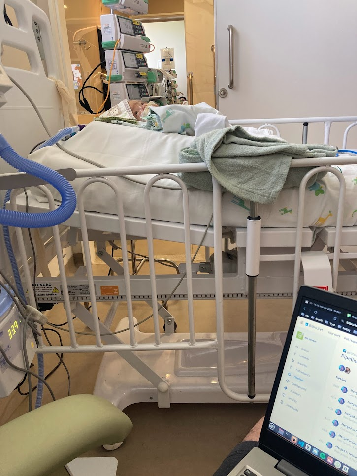

# Breve Relato de Um Pai + Agradecimento Krykto
Criado: 21/07/2024 22:47

Depois de 9 dias do nascimento dos gêmeos, recebi a notícia de que um deles teria que fazer uma cirurgia no intestino. Foi quando se iniciou a experiência mais transformadora da minha vida. Foram muitos altos e baixos, crises, esperanças e aprendizados. Mas depois de 6 meses e 3 cirurgias, o Tomas foi pra casa, "um milagre".

Ainda que ele não estivesse aqui, ele seria um milagre. Milagre é quando nossas expectativas não são frustradas? 

Claro que o meu desejo sempre foi estar com ele em casa e nunca ter passado por isso, mas talvez se eu soubesse tudo que teríamos de passar para que fossemos transformados, hoje eu não estaria aqui abrindo meu coração.

No meu caso, o meu milagre foi entregar meu filho nas mãos de Deus e continuar vivendo minha vida, que, independente do visível aparente e do que aconteceria no fim, estava cooperando para transformações de vidas, relacionamentos e famílias.

> _"Nossa paixão por definir a vida e a morte sempre nos desencaminha. Não fomos criados para deter o conhecimento do bem e do mal" - Larry Crabb_

Desde então, tento encarar tudo que acontece na vida, seja bom ou ruim, de forma pedagógica, e oro a Deus que ele ilumine meu pensamento em cada situação, com o que ele quer ensinar, e não mais pedindo algo, como quem não confia no propósito da existência. Mas como um verdadeiro pai ensinando seu filho.

Enfim, o Tomas está em casa há 3 meses, perto do irmãozinho e recebendo muito carinho. Eu não iria escrever sobre isso aqui, mas como estou me despedindo da **Krykto**, precisei contextualizar, para agradecer publicamente as amizades que pude fazer e por marcarem essa fase com todo apoio que me deram, do nascimento aos dias de hoje, e por permitir momentos como esse, em que pude trabalhar ao lado do meu guerreiro.

Obrigado a todos, e até a próxima! ❤️